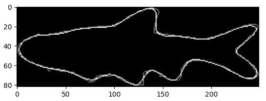

# INHS Fish Outlining



## Setup
### 1.
Ensure you have the latest version of `fish.db`. I've reached my free Git LFS quota, so the copy included here may be old. The latest version has this SHA1 hash:
```
$ sha1sum fish.db
7a047498773f207c17fbecf0d63fbd9365f973b5  fish.db
```
If your version differs, please download the latest:
```
wget http://andrewsenin.com/fish.db
```
### 2.
Create a __Python 3__ virtual environment in the top level of the repository:
```
$ python -m venv venv/
$ source venv/bin/activate
(venv) $ pip install -r requirements.txt
```

## Reproducing presentation results
### 1.
Generate the dataset. This shouldn't take more than one half hour on an average processor:
```
python datagen.py
```
This produces the following dataset files in the current directory:
* `1mm_fifteen_species.csv`
* `1mm_seven_genera.csv`
* `1mm_aug_seven_genera.csv`

### 2.
Run the classification experiment by loading your desired dataset in `classification.ipynb` and running all the cells.

## Querying and viewing fish
To examine fish, you may either launch an interactive session via
```
$ python -i inhs_outlining.py 
```
or import the necessary libraries into a script of your own
```python
from inhs_outlining import *
```
You can fetch particular fish in a few different ways:
```python
>>> one_boops = Fish.example_of("Notropis", "Boops")
>>> all_cyanelluses = Fish.all_of_species("Lepomis", "Cyanellus")
>>> fish_5099 = Fish.with_id("5099")
```
Then, you can view their outlines using their `show_reconstruction()` methods.

## Associated publications
J. Pepper, J. Greenberg, Y. Bakiş, X. Wang, H. Bart and D. Breen, "Automatic Metadata Generation for Fish Specimen Image Collections," 2021 ACM/IEEE Joint Conference on Digital Libraries (JCDL), 2021, pp. 31-40, doi: [10.1109/JCDL52503.2021.00015](https://doi.org/10.1109/JCDL52503.2021.00015).

Kevin Karnani, Joel Pepper, Yasin Bakis et al. Computational Metadata Generation Methods for Biological Specimen Image Collections, 27 April 2022, PREPRINT (Version 1) available at Research Square <https://doi.org/10.21203/rs.3.rs-1506561/v1>
